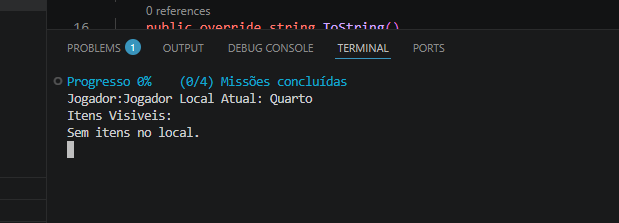

# Jogo POO em C# – Feiticeiro e Magia

Projeto desenvolvido em C# para a disciplina de Programação Orientada a Objetos.  
O jogo implementa conceitos fundamentais de POO como classes, objetos, herança, encapsulamento e métodos, num ambiente temático de magia e feitiçaria.

## 🎮 Funcionalidades
- Sistema de personagem (feiticeiro)
- Magias e habilidades
- Pontuação e progressão
- Estrutura modular orientada a objetos
- Interface gráfica (Windows Forms)

## 🧰 Tecnologias utilizadas
- C#
- .NET
- Visual Studio
- Programação Orientada a Objetos

## ▶️ Como executar
1. Abrir o projeto no **Visual Studio**
2. Compilar a solução (`Jogobase.sln`)
3. Executar o jogo

## 📸 Screenshot

## 👤 Autor
**Marco Monteiro**
